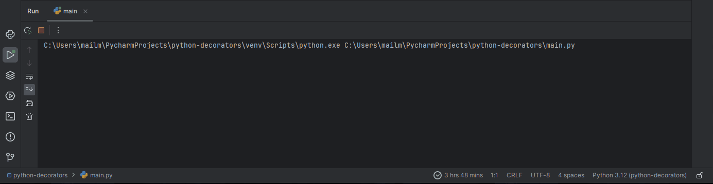
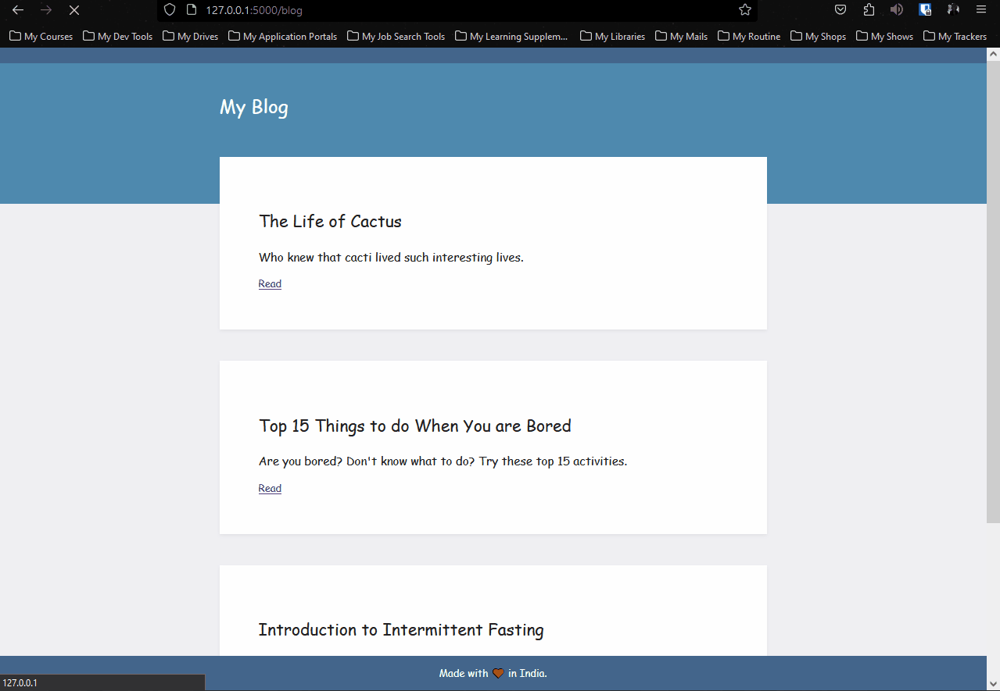
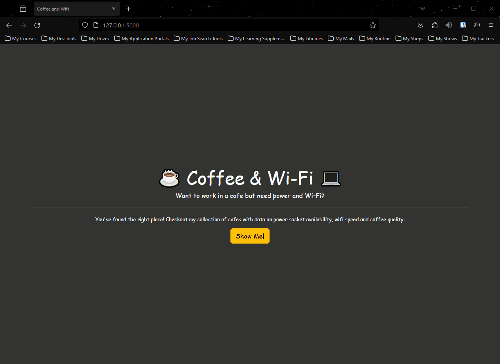

# Python Flask Web Development Projects

These python Flask web development projects are built in correspondence with " [100 Days of Code - The Complete Python Pro Bootcamp](https://www.udemy.com/course/100-days-of-code/) " course. This course was taught by London's App Brewery top instructor Angela Yang. 

Each project has been built from scratch with minimal to no assistance. 

### Day 054 - Python Decorator

This project involves constructing your own custom python decorator. 

Here, we created a delay constructor that prints "How are you?" after a 2 second delay.

For a live version, go [here](https://replit.com/@grandeurkoe/python-decorators?v=1) .

### Day 055 - Higher or Lower URLs

This project simulates a Higher or Lower URLs website using the Flask framework. Generate a random integer using the randint() function from the random module. This random integer is the number that the player has to guess.

Website Navigation:
- The Higher or Lower URLs website is running on a development server that Flask ships with.
- Use the "/" route to navigate to the homepage.
- Use the "/guessed_number" route to play the  Higher or Lower URLs game. Get the guessed_number as user input.
- If the guessed_number is less than the correct number, then display a webpage with "Too low, try again!" red heading and a funny GIF.
- If the guessed_number is greater than the correct number, then display a webpage with "Too high, try again!" purple heading and a funny GIF.
- If the guessed_number is correct, then display a webpage with "You found me!" green heading and a funny GIF.

### Day 056 - Name Card

This project simulates a Name Card website using the Flask framework. Use [Aerial](https://html5up.net/aerial) template from [HTML5 UP](https://html5up.net/) website.

Website Navigation:
- The Name Card website is running on a development server that Flask ships with.
- Use the "/" route to navigate to the name card webpage.

For a live version, go [here](https://replit.com/@grandeurkoe/name-card?v=1) .

### Day 057 - Blog (v1)

This project simulates a Blog website using the Flask framework.

Website Navigation:
- The Blog website is running on a development server that Flask ships with.
- Use the "/blog" route to navigate to the blog webpage.
- Each post on the blog webpage has a "Read" link.
- Click on "Read" link to navigate to that post's webpage.
- Use the "/post/post_id" route to navigate to each post based on post_id (integer).

### Day 059 - Blog (v2)

This project simulates a Blog website using the Flask framework. This website was built using the Bootstrap5 framework. Use the requests module to get post data from the [npoint](https://api.npoint.io/eb6cd8a5d783f501ee7d) API. Store the newly acquired JSON response. Use the Jinja template engine to create "header.html" and "footer.html" templates. Jinja allows you to add python code to HTML files.

Website Navigation:
- The Blog website is running on a development server that Flask ships with.
- Use the "/" route to navigate to the blog homepage.
- Each post on the homepage is a link.
- Click on post link to navigate to that post's webpage.
- Click on "ABOUT" link to navigate to the about webpage.
- Click on "CONTACT" link to navigate to the contact webpage.
- Use the "/post/post_id" route to navigate to each post based on post_id (integer).
- Use the "/" route to navigate to the blog homepage.
- Use the "/about" route to navigate to the about webpage.
- Use the "/contact" route to navigate to the contact webpage.

For a live version, go [here](https://replit.com/@grandeurkoe/better-blog?v=1) .

### Day 060 - Blog (v3)

This project is an upgraded version of [Blog (v2)](#day-059---blog-v2) with a functional contact form. 

For a live version, go [here](https://replit.com/@grandeurkoe/better-blog-with-contact?v=1) .

### Day 061 - Flask Secrets

This project simulates a Flask Secrets website using the Flask framework. Use the flask_wtf and wtforms module to generate and validate the Login Form. Use the flask_bootstrap module to render LoginForm form in login webpage.

Website Navigation:
- The Flask Secrets website is running on a development server that Flask ships with.
- Use the "/" route to navigate to the secrets homepage.
- Click the "Login" button to navigate to the login webpage.
- Use the "/login" route to navigate to the login webpage.
- If the credential entered in the LoginForm form are incorrect, then display "denied.html" webpage.
- If the credential entered in the LoginForm form are correct, then display "success.html" webpage.

For a live version, go [here](https://replit.com/@grandeurkoe/flask-secrets?v=1) .

### Day 062 - Coffee and Wi-Fi

This project simulates a Coffee and Wi-Fi website using the Flask framework. Get cafe data from "cafe-data.csv" and store it. Use the flask_wtf and wtforms module to generate and validate the CafeForm form. Use the flask_bootstrap module to render CafeForm form in add webpage.

Website Navigation:
- The Coffee and Wi-Fi website is running on a development server that Flask ships with.
- Use the "/" route to navigate to the Coffee and Wi-Fi homepage.
- Click the "Show Me!" button to navigate to the cafes webpage.
- Click "return to index page" link to navigate to the Coffee and Wi-Fi homepage.
- Use the "/add" route to navigate to the add webpage.
- Click "See all cafes" link to navigate to the Coffee and Wi-Fi homepage.
- Fill CafeForm form and click "Submit" button.
- On clicking "Submit" button,  append new cafe details (obtained from Cafe form) to "cafe-data.csv" and redirect to cafes webpage.
- Use the "/cafes" route to navigate to the cafes webpage.

### Day 063 - Library

This project simulates a Library website using the Flask framework. 

Steps involved in working with SQLAlchemy:
1. Create the app.
2. Configure the SQLite database (new_library.db), relative to the app instance folder.
3. Create an SQLAlchemy object .
4. Initialize the app with the extension.
5. Create table (Book).
6. Perform CRUD operations on table using SQLAlchemy object.

Website Navigation:
- The Library website is running on a development server that Flask ships with.
- Use the "/" route to navigate to the Library homepage.
- If the "Book" table has no entries, then the Library homepage will display a paragraph mentioning that the "Library is empty".
- If the "Book" table has entries, then the Library homepage will display each book entry with an "Edit rating" and "Delete" link at both ends.
- Click "Delete" link for a particular book to delete it from "Book" table.
- Click "Edit rating" to navigate to the edit webpage for that book.
- Enter new rating in the field and click "Change rating". This will update the rating for that book in the "Book" table and redirect to the Library homepage.
- Click "Add book" link on the Library homepage to navigate to the add webpage.
- Fill the form with new book details and click "Add book". This will create a new book entry in the "Book" table and redirect to the Library homepage.
- Use the "/add" route to navigate to the add webpage.

For a live version, go [here](https://replit.com/@grandeurkoe/library-project?v=1) .

### Day 064 - Top Movie

This project simulates a Top Movie website using the Flask framework.  Use the flask_wtf and wtforms module to generate and validate the AddMovieForm and UpdateMovieForm forms. Use the flask_bootstrap module to render AddMovieForm and UpdateMovieForm forms in add and edit webpage respectively.

Steps involved in working with SQLAlchemy:
1. Create the app.
2. Configure the SQLite database (top-movies.db), relative to the app instance folder.
3. Create an SQLAlchemy object .
4. Initialize the app with the extension.
5. Create table (Movie).
6. Perform CRUD operations on table using SQLAlchemy object.

Website Navigation:
- The Top Movie website is running on a development server that Flask ships with.
- Use the "/" route to navigate to the Top Movie homepage.
- Click "Add movie" button on the Top Movie homepage to navigate to the add webpage.
- Fill the AddMovieForm form with the name of the movie you wish to add and click "Add movie" button. Use the requests module to get movie data from [The Movie Database (TMDB)](https://developer.themoviedb.org/reference/intro/getting-started) API. Store the newly acquired JSON response and redirect to the select webpage.
- Display each movie data as a link on the select webpage.
- Click on one of the links and redirect to edit webpage.
- Fill the UpdateMovieForm form to add rating and review for the movie you selected previously. This will create a new movie entry in the "Movie" table and redirect to the Top Movie homepage.
- The Top Movie homepage will now display this newly added movie along with its details as a flippable card.
- Hover over the movie card to flip it. The flipped card has two buttons ("Update" and "Delete") that will allow you to edit and delete that movie entry.
- Click "Delete" button for a particular movie to delete it from "Movie" table.
- Click "Update" to navigate to the edit webpage for that movie.
- Use the "/add" route to navigate to the add webpage.
  

### Day 066 - Cafe API

This projects involves building your own custom Cafe API using RESTful routing. Here, we use Postman for building and using APIs.

Steps involved in working with SQLAlchemy:
1. Create the app.
2. Configure the SQLite database (cafes.db), relative to the app instance folder.
3. Create an SQLAlchemy object .
4. Initialize the app with the extension.
5. Create table (Cafe).
6. Perform CRUD operations on table using SQLAlchemy object.

Website Navigation:
- The Cafe API website is running on a development server that Flask ships with.
- Use the "/" route to navigate to the Cafe API homepage.
- Use the "/random" route to fetch a random cafe from the cafes database and display it in JSON format.
- Use the "/all" route to fetch all the cafe data from the cafes database and display it in JSON format.
- Use the "/search" route to search the cafes database for a cafe that matches the location queried. Use the loc parameter to pass a location name.
- Use the "/add" route to add a new cafe entry into the cafes database. Requires authentication with api-key parameter.
- Use the "/update-price" route to update black coffee price at a particular cafe using the id and new_price parameters.
- Use the "/report-closed" route to delete a cafe entry from the cafes database. You will need to provide the ID of the cafe to delete as a route. You will also need to provide a valid API for this operation to be allowed.

### Day 067 - Blog (v4)

This project is an upgraded version of [Blog (v3)](#day-060---blog-v3). Use the flask_wtf and wtforms module to generate and validate the PostForm form. Use the flask_bootstrap module to render PostForm form in new-post and edit-posts webpage.

Features added:
- Create new blog post.
- Edit existing blog post.
- Delete existing blog post.

Steps involved in working with SQLAlchemy:
1. Create the app.
2. Configure the SQLite database (posts.db), relative to the app instance folder.
3. Create an SQLAlchemy object .
4. Initialize the app with the extension.
5. Create table (BlogPost).
6. Perform CRUD operations on table using SQLAlchemy object.

Website Navigation (for new features):
- Click "Create New Post" button in the Blog homepage to navigate to the new-post webpage.
- Fill the PostForm form with new post details and click the "Submit Post" button. This will create a new post entry in the "BlogPost" table and redirect to the Blog homepage.
- This newly created blog post will be displayed on the Blog homepage.
- Each blog post displayed on the Blog homepage has an "✘" link. Click on "✘" to delete that entry from the "BlogPost" table and redirect to the Blog homepage. The Blog homepage will no longer display the deleted blog post.
- Each blog post (only post title and subtitle) on the Blog homepage is  a hyperlink. Click on one the blog post link to navigate to their post webpage.
- Each post webpage has an "Edit Post" button. Click on this button to navigate to the edit-post webpage for that blog post. Fill the form with the new changes you wish to make and click the "Submit Post" button. This will update that post entry in the "BlogPost" table and redirect to the Blog homepage.
- The changes to the blog post will now be reflected everywhere. 

For a live version, go [here](https://replit.com/@grandeurkoe/upgraded-blog?v=1) .

### Day 068 - Flask Authentication

This project simulates a Flask Authentication website using the Flask framework. Use the flask_login module to add session management capabilities to your Flask website. Use the werkzeug.security module to generate and check password hash. 

Steps involved in working with SQLAlchemy:
1. Create the app.
2. Configure the SQLite database (users.db), relative to the app instance folder.
3. Create an SQLAlchemy object .
4. Initialize the app with the extension.
5. Create table (User).
6. Perform CRUD operations on table using SQLAlchemy object.

Website Navigation:
- The Flask Authentication website is running on a development server that Flask ships with.
- Use the "/" route to navigate to the Flask Authentication homepage.
- The Flask Authentication homepage has two buttons, namely "Login" and "Register".
- Click the "Register" button to navigate to the register webpage. Fill the form with new user details and click "Sign me up". Use generate_password_hash() function to generate hash for your password. Store this password hash instead of your real password in "User" table Finally, push this entry to the "User" table and redirect to the secrets webpage. Before redirecting to the secrets webpage, pass the new user as an argument to the login_user() function to create a session for this user.
- Click "Download your file" link to navigate to the download webpage. Here, you can read and download the Flask cheatsheet.
- Click the "Login" button in the Flask Authentication homepage to navigate to the login webpage. Fill the form with your credentials. Use the  check_password_hash() function to check if the password hash matches with the ones in the "User" table.
- If a match is found, then create a session for this user and navigate to the secrets webpage.
- If you are logged in, then click "Logout" to logout(using the logout_user() function) the current user.
- You need to be logged in to access the follow routes: "/secrets", "/download", "/logout" and "/download".
- Use the "/login" route to navigate to the login webpage.
- Use the "/register" route to navigate to the register webpage.

For a live version, go [here](https://replit.com/@grandeurkoe/upgraded-blog?v=1) .

